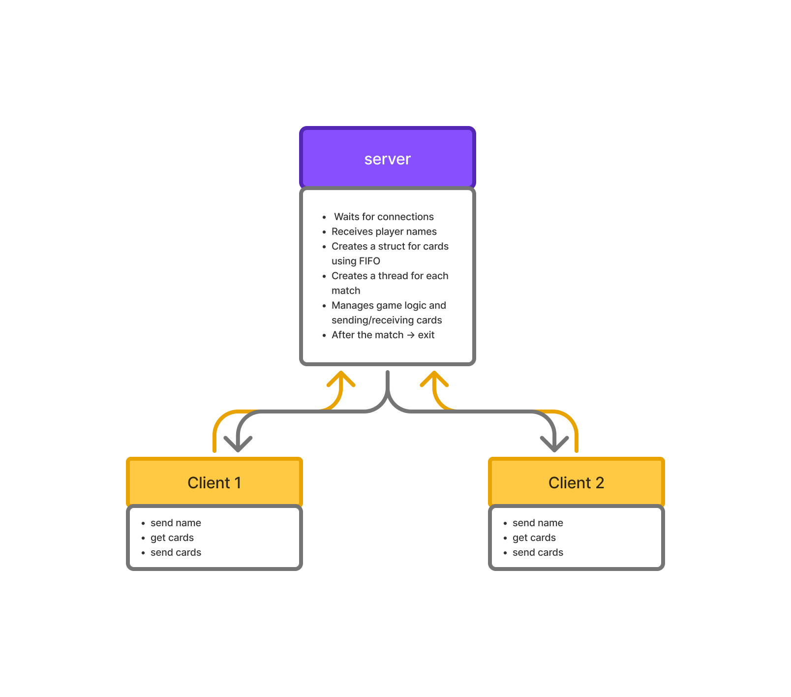

# Exploding-Raccoons

Exploding Raccoons is a fun and strategic card game for 2–5 players, where the goal is to be the **last player alive**.

### How to play, briefly:
- Each player draws a card on their turn.
- If a player draws an **Exploding Raccoon**, they are eliminated **unless they have a Defuse card** to save themselves.
- Other cards allow you to skip another player’s turn, look at the next cards in the deck, or shuffle the deck.
- The game combines **luck** (which card you draw) with **strategy** (how and when you use special cards).

### Objective:
Be the **last player who does not explode**.

## Game Architecture

```bash
game_project/
├── server/
│   └── server.c
├── client/
│   └── client.c
```

## Server
This means that the server is the **brain of the game**. It owns and manages everything related to the game state.  
Examples for Exploding Raccoons:
- Creates and shuffles the card deck.
- Keeps track of the cards in each player's hand.
- Determines when a player explodes or wins.
- Applies the effects of played cards (Skip, Attack, Defuse, Shuffle, etc.).
- Sends updates to all players (via text messages, for example).
## Client
It communicates with the server and shows the game state to the player.
- The client opens a TCP connection to the server (IP + port).
- Sends the player’s name to identify themselves.
- Shows the player’s hand of cards.
- Shows the current turn and basic game info.
- Updates in real-time when the server sends changes (cards played, opponent moves, etc.).
- Can use ncurses to create a nice terminal UI.