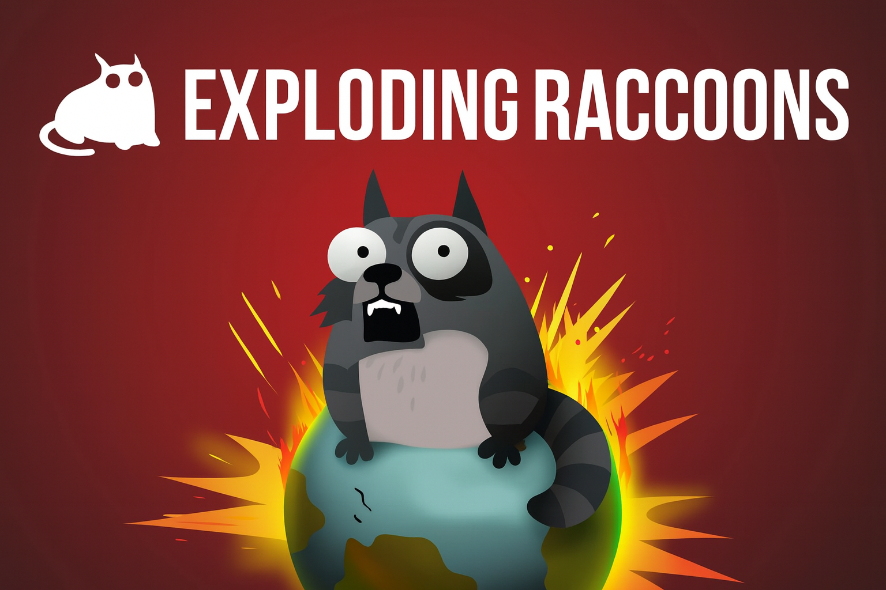
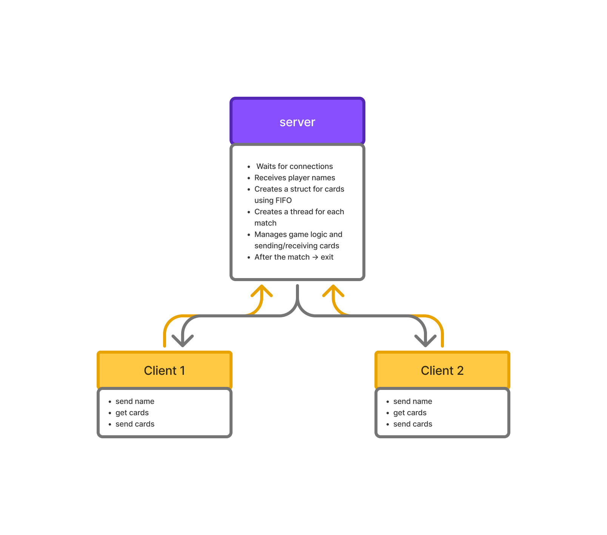

# Exploding-Raccoons


- [0.0 Summary](#00-summary)
  - [0.1 How to play, briefly](#01-how-to-play-briefly)
  - [0.2 Objective](#02-objective)
- [1.0 Game Architecture](#10-game-architecture)
  - [1.1 Server](#11-server)
  - [1.2 Client](#12-client)
- [2.0 Player Flow](#20-player-flow)
  - [2.1 Enter The Player Name](#21-enter-the-player-name)
  - [2.2 Player select The Match](#22-player-select-the-match)
  - [2.3 Player set the Ready status](#23-player-set-the-ready-status)

# 0.0 Summary

Exploding Raccoons is a fun and strategic card game for 2–5 players, where the goal is to be the **last player alive**.

## 0.1 How to play, briefly:
- Each player draws a card on their turn.
- If a player draws an **Exploding Raccoon**, they are eliminated **unless they have a Defuse card** to save themselves.
- Other cards allow you to skip another player’s turn, look at the next cards in the deck, or shuffle the deck.
- The game combines **luck** (which card you draw) with **strategy** (how and when you use special cards).

## 0.2 Objective:
Be the **last player who does not explode**.

# 1.0 Game Architecture

```bash
game_project/
├── server/
│   └── server.c
├── client/
│   └── client.c
```

## 1.1 Server
This means that the server is the **brain of the game**. It owns and manages everything related to the game state.  
Examples for Exploding Raccoons:
- Creates and shuffles the card deck.
- Keeps track of the cards in each player's hand.
- Determines when a player explodes or wins.
- Applies the effects of played cards (Skip, Attack, Defuse, Shuffle, etc.).
- Sends updates to all players (via text messages, for example).
Every client is a thread that is created when server detect the scoket that want to be connected. 
```c
// server .c
// code ...
while (1) {
        int client_sock = accept(server_sock, NULL, NULL);
        if (client_sock < 0) {
            perror("Accept error");
            continue;
        }
        int* sock_ptr = malloc(sizeof(int));
        *sock_ptr = client_sock;
        pthread_t tid;
        pthread_create(&tid, NULL, client_thread, sock_ptr);
        pthread_detach(tid); // prevents memory leaks
    }
//code
```
## 1.2 Client
It communicates with the server and shows the game state to the player.
- The client opens a TCP connection to the server (IP + port).
- Sends the player’s name to identify themselves.
- Shows the player’s hand of cards.
- Shows the current turn and basic game info.
- Updates in real-time when the server sends changes (cards played, opponent moves, etc.).
- Can use ncurses to create a nice terminal UI.
# 2.0 Player Flow 
##  2.1 Enter The Player Name 
```c
// server.c
void enter_name(int client_sock) // sent message to player, verify if player exist
```
```c
// client.c
void enter_name(int sock, Player_t *user)// get messages and sent user name 
```
Handles the process of receiving a username from a newly connected client.
The function repeatedly asks the client to enter a name until they submit one that is not already used by another player.
If the name is available, a new Player_t is created, added to the global Players list, and the client is welcomed into the game.
### Behavior

1) Sends the message "Enter your name:" to the client.
2) Receives a string from the client.
3) Checks if the name already exists in the player list using exist_player(...).
4) If the name is not taken: Sends "You Join!" to the client. Creates a new Player_t with create_user(...).
5) Adds the new player to the global players array using add_player(...).
6) If the name is taken: Sends "Name already taken. Try again:"Repeats the loop until a valid name is entered.
## 2.2 Player select The Match
```c
// server.c
void select_match(int client_sock)
```
```c
// client.c
void select_match(int sock, Player_t player)
```
Allows a connected and registered player to choose a match (game room) to join.
The function displays the available matches, waits for the client to select a match ID, validates the selection, and—if valid—adds the player to that match.
### Behavior

1) Builds a list of all available matches using print_matches(...).
2) Sends the match list to the client.
3) Prints the same list on the server console for debugging/logging.
4) Waits for the client to send back a match ID.
5) Converts the received string to an integer using atoi.
6) Validates the chosen ID: 
7) If the ID is out of range or the match is full (is_match_full(...)), the client is informed and asked again.         
    Otherwise, the player is added to the selected match.
    On success:Sends "You Join!" to the client.
8) Logs the successful join in the server console.
## 2.3 Player set the Ready status